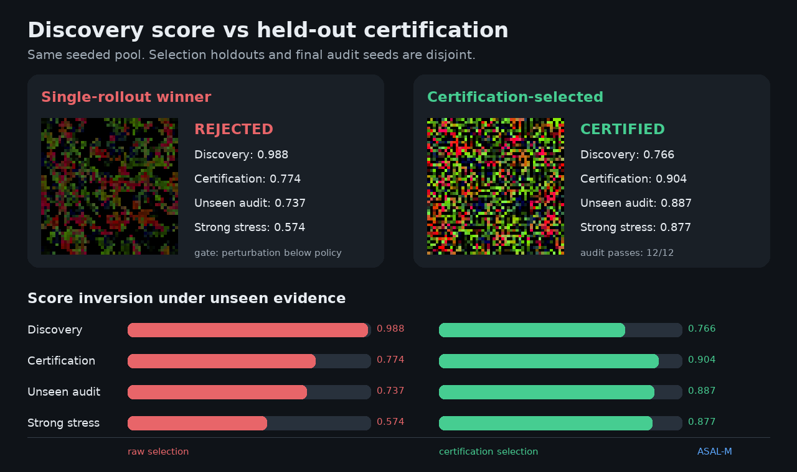

# ASAL-M

**Held-out certification for open-ended simulation discovery**

Search can find something that looks exceptional once. ASAL-M asks the harder
question: does the discovered regime still hold under replay, longer horizons,
perturbations, nearby configurations, and seeds the search never saw?



ASAL-M is a lightweight Python workbench for freezing, challenging, ranking,
and explicitly accepting or rejecting discoveries from artificial-life and
other simulation search systems.

It is an independent project, not an official Sakana AI repository.

## The result

The bundled benchmark generates the same seeded pool of 30 candidates, selects
the six highest single-rollout scores for certification, and then freezes two
choices for a final audit on 12 unseen seeds and stronger perturbations.

| Selection rule | Discovery score | Gate decision | Unseen audit | Audit passes |
|---|---:|---|---:|---:|
| Highest single rollout | **0.988** | Rejected: perturbation floor | 0.737 | 0 / 12 |
| ASAL-M certification | 0.766 | **Certified** | **0.887** | **12 / 12** |

On this fixed benchmark, certification produces a `+0.150` absolute (`+20.3%`
relative) unseen-audit gain. This is a reproducible engineering result on one
bundled substrate—not a claim of universal superiority.

Evidence: [benchmark protocol](examples/certification_benchmark/README.md) ·
[complete JSON](examples/certification_benchmark/benchmark.json)

Reproduce it:

```sh
python -m pip install -c requirements-repro.txt -e .
python examples/certification_benchmark/regenerate.py
```

The release constraints, canonical public-float policy, bundled font assets,
and exact artifact hashes are documented in the
[reproducibility contract](docs/REPRODUCIBILITY.md).

## Why a certification layer?

Optimizers exploit the score they can see. A compelling rollout can therefore
be a lucky seed, a brittle parameter island, or a regime that collapses under a
small shock. Ranking everything by one average also allows strong dimensions to
hide a catastrophic one.

ASAL-M separates the workflow:

```text
proposal → discovery rollout → shortlist
         → replay + long horizon + perturbation + neighborhood + held-out seeds
         → hard certification decision
         → freeze candidate + policy
         → operator-owned audit on untouched evidence
```

The generic runner performs certification. A final audit is a separate frozen
protocol because only the operator can guarantee that its evidence did not
influence discovery, calibration, or selection. The bundled benchmark makes
the three execution partitions disjoint. Because its protocol and results were
first published together, repository history alone does not prove prospective
reservation. Future stronger claims can use the
[protocol registration](docs/PROTOCOL_REGISTRATION.md) workflow.

The `promotion` winner is chosen lexicographically: certification state first
(`certified`, then `rejected`, then not evaluated), aggregate promotion score
second, and discovery total only as the final tie-breaker. The aggregate score
does **not** certify a candidate. Certification requires every configured hard
gate to pass, and reports missing evidence as `not_evaluated` rather than
pretending it is a failed experiment.

Default `v1` gates:

| Check | Default requirement |
|---|---:|
| Deterministic replay | required |
| Replay difference | ≤ `1e-9` |
| Long horizon | ≥ `0.70` |
| Perturbation | ≥ `0.65` |
| Neighborhood | ≥ `0.45` |
| Held-out seeds | ≥ `0.70` |
| Aggregate promotion score | ≥ `0.75` |

These are transparent demo defaults, not universal scientific constants. Every
threshold can be declared in the experiment's `certification_policy` mapping.

## What is included

- a substrate contract separating simulations from search and evaluation;
- a deterministic reference proposer using seeded sampling and mutation;
- elite, novelty, and robustness archives;
- composite trajectory and mechanism signals;
- explicit certification policies with machine-readable failure codes;
- replay, long-horizon, perturbation, neighborhood, and held-out-seed checks;
- YAML experiments, a CLI, analysis tools, tests, packaging, and CI;
- two standalone simulation substrates for reproducible examples.

The bundled proposer is intentionally modest. ASAL-M's differentiator is the
certification boundary; external agents and optimizers can supply candidates.

## Install

Python 3.10+:

```sh
python -m venv .venv

# Windows
.venv\Scripts\activate

# Linux / macOS
source .venv/bin/activate

python -m pip install -U pip
python -m pip install -e .
```

The core demos require NumPy, PyYAML, and Pillow. No model API, GPU, or JAX
installation is required.

For development and plotting:

```sh
python -m pip install -e ".[dev,analysis]"
```

## Quickstart

```sh
# Search a bundled substrate
python -m asal_m --experiment mut_cells_promotion --budget 6 --steps 48

# Lightweight second substrate
python -m asal_m --experiment alpha_mainline --budget 4 --steps 32

# Reproduce the fixed certification result
python examples/certification_benchmark/regenerate.py

# Reproduce the standalone simulation postcard
python examples/public_demo/regenerate.py
```

Outputs land under `runs/<experiment-name>/`. `budget` counts attempted
proposals; `evaluated` can be smaller when candidates fail the prefilter.

CLI winner output includes `certification=certified`, `rejected`, or
`not-evaluated`. For validated winners, run JSON contains the complete policy,
per-gate values, thresholds, evaluation status, and failure codes.

Full walkthrough: [user guide](docs/USER_GUIDE.md).

## Bring your own substrate

Implement the small simulation contract:

```python
class MySubstrate:
    name = "my_substrate"

    def reset(self, config: dict, seed: int) -> None: ...
    def step(self, n: int = 1) -> None: ...
    def render_frame(self): ...
    def get_state(self): ...
    def set_state(self, state) -> None: ...
    def extract_metrics(self) -> dict[str, float]: ...
    def apply_perturbation(self, perturbation: dict) -> None: ...
    def is_extinct(self) -> bool: ...
```

Then register its factory and search space, write a YAML experiment, and define
perturbations and certification thresholds appropriate to that domain.

Walkthrough: [adding a substrate](docs/ADDING_A_SUBSTRATE.md) ·
[architecture](docs/ARCHITECTURE.md) · [experiment reference](docs/EXPERIMENTS.md)

## Documentation

- [User guide](docs/USER_GUIDE.md) — install, first run, outputs, analysis, and troubleshooting
- [Experiment reference](docs/EXPERIMENTS.md) — every public YAML field and default
- [Architecture](docs/ARCHITECTURE.md) — boundaries, data flow, and contracts
- [Adding a substrate](docs/ADDING_A_SUBSTRATE.md) — implementation and test checklist
- [Reproducibility](docs/REPRODUCIBILITY.md) — full-precision computation, canonical evidence, and release hashes
- [Protocol registration](docs/PROTOCOL_REGISTRATION.md) — prospective commitments for stronger audit provenance
- [Claim boundary](CLAIM_BOUNDARY.md) — what results do and do not establish
- [Release checklist](docs/RELEASE_CHECKLIST.md) — maintainer publication gate
- [Changelog](CHANGELOG.md) — versioned public changes

## Repository map

```text
asal_m/                           package: runner, search, scoring, validation
docs/                             user, configuration, architecture, extension guides
examples/certification_benchmark/ partition-disjoint comparison + real evidence
examples/public_demo/             fixed-seed simulation postcard
tests/                            unit, integration, privacy, and CLI tests
tools/                            public evidence and documentation verification
.github/workflows/                Python matrix + package verification
```

## Tests

```sh
pytest -q
```

CI tests Python 3.10, 3.12, and 3.14 on Windows and Ubuntu, enforces 80% package
coverage, builds the wheel and source distribution, scans the prospective
repository and both archives, inspects packaged licenses and experiment YAMLs,
and smoke-tests the installed wheel outside the source tree—including the
default flagship command. A separate six-cell Windows/Ubuntu matrix regenerates
all four public evidence artifacts under the pinned release constraints and
requires exact byte identity. CI also verifies local documentation links and
evidence integrity under normal and optimized Python.

## Related work and scope

[Sakana AI's ASAL](https://github.com/SakanaAI/asal) introduced foundation-model
guided search for interesting and open-ended artificial-life simulations.
ASAL-M focuses on a narrower downstream problem: deciding whether a selected
regime survives protocol pressure and unseen evidence. The public repository
does not vendor the upstream ASAL source tree.

The discovery/certification separation also reflects a broader closed-loop
research lesson: validation-selected improvements need a final test they could
not optimize against. See
[Closed-loop Auto Research for Molecular Property Prediction](https://arxiv.org/abs/2606.22731).

ASAL-M claims software behavior and protocol-scoped metrics. It does not claim
life, sentience, scientific discovery, or a universally superior optimizer. See
[CLAIM_BOUNDARY.md](CLAIM_BOUNDARY.md).

## Author and license

Created by [Leonid Majbits](https://github.com/LeonidMajbits) with assisted
engineering tools disclosed in [AUTHORS.md](AUTHORS.md).

Apache-2.0: [LICENSE](LICENSE) · related-work attribution: [NOTICE](NOTICE)

Contributions: [CONTRIBUTING.md](CONTRIBUTING.md) · security reports:
[SECURITY.md](SECURITY.md)

Release verification, signatures, SBOMs, attestations, historical scanner
scope, and immutable-release boundaries:
[RELEASE_INTEGRITY.md](docs/RELEASE_INTEGRITY.md)

## Status

Research software, version `0.1.3`. The benchmark is fixed and reproducible
under the documented scientific and release-artifact contracts; additional
substrates, external proposer adapters, and independently calibrated domain
policies remain future work.
